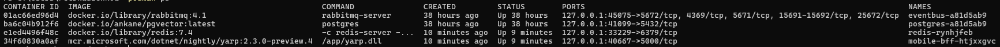

# Getting started

# 1. Local Dev Environment

Clone the eShop repository: https://github.com/petr-rudzenkou/eShop

## Prerequisites
1. [.NET 9](https://dotnet.microsoft.com/en-us/download)
2. [Aspire CLI](https://learn.microsoft.com/en-us/dotnet/aspire/cli/install)
     ```powershell
     dotnet tool install -g Aspire.Cli --prerelease
     ```
3. OCI compliant container runtime:
   - Docker
      - [Install Docker Desktop on Windows](https://docs.docker.com/desktop/setup/install/windows-install/)
      - [Install Docker Desktop on Mac](https://docs.docker.com/desktop/setup/install/mac-install/)
   - Podman
      - [Podman Installation Instructions](https://podman.io/docs/installation)
      - [Podman for Windows guide](https://github.com/containers/podman/blob/main/docs/tutorials/podman-for-windows.md)
4. Integrated Developer Environment (IDE) or code editor:
   - [Visual Studio 2022](https://visualstudio.microsoft.com/vs/) version 17.9 or higher
   - [Visual Studio Code](https://code.visualstudio.com/)
     - Extension: [C# Dev Kit](https://marketplace.visualstudio.com/items?itemName=ms-dotnettools.csdevkit)

# 2. Exploring Runtime Architecture

## eShop Reference Application


The application consists of:
 - 2 Frontends
 - 5 APIs
 - 2 Processors
 - 4 Databases
 - Cache
 - Event Bus
 - Monitoring system

## Running the Project

1. Start the application by running:

```bash
aspire run
```

2. Watch the console output for initialization messages

3. Look for the dashboard URL in the console output (typically something like `https://localhost:19888/login?t=4f08cd9d2bfc2a0ee873fdb8c7bf11e6`)

4. Open the Aspire dashboard in your browser to examine the application structure, logs, traces.

5. Check the running containers:

```bash
docker ps
```



## Troubleshooting Common Issues

### Unhealthy resources
Give some time for the services to warm-up

### SSL Certificate Issues
If you encounter SSL/TLS connection errors, run:

```bash
dotnet dev-certs https --trust
```

### PUBLISHING FAILED: An error occurred trying to start process 'docker' with working directory
This error occurs if you're using podman as the container runtime. By default Aspire uses docker. You'll need to tell Aspire to use posman:

```bash
aspire run ASPIRE_CONTAINER_RUNTIME=podman
```

### Port Conflicts
If you experience port conflicts:
1. Stop all running Docker containers:

```bash
docker stop $(docker ps -q)
```

2. Re-run the AppHost project

### Note
Make sure you've completed all the setup requirements from the Local Dev Environment guide before running the project.

# 3. Publishing and Deployement

## 1. Aspire CLI
The Aspire Command Line Interface will provide enhanced capabilities for:

### Features
- Project scaffolding and templates
- Local development orchestration
- Enhanced Publish/Deploy Semantics
- Support for generation of IaC artifacts for multiple providers (Bicep, K8S, Docker Compose)
- Broader deployment targets, including non-Azure environments.

### How to install?

```bash
dotnet tool install -g Aspire.Cli --prerelease
```

## 1. Azure

### Publish
Add Azure Container App environment to your AppHost project using the AddAzureContainerAppEnvironment method:

```csharp
var builder = DistributedApplication.CreateBuilder(args);
builder.AddAzureContainerAppEnvironment("aca-env");
```

Generate Bicep manifests from your Aspire application:

```bash
aspire publish -o aca-artifacts
```

Review the contents of the `aca-artifacts` folder, which will include Bicep templates for all application resources.

### Deploy (Optional)

[Azure CLI](https://learn.microsoft.com/en-us/cli/azure/install-azure-cli) should be installed to perform this step.

```bash
az login
```

Deploy Aspire application to Azure:

```bash
aspire deploy
```

## 2. Kubernetes

### Publish

Add a Kubernetes environment to your AppHost project using the AddKubernetesEnvironment method:

```csharp
var builder = DistributedApplication.CreateBuilder(args);
builder.AddKubernetesEnvironment("k8s");
```

Generate Kubernetes manifests from your Aspire application:

```bash
aspire publish -o k8s-artifacts
```

Review the contents of the `k8s-artifacts` folder, which will include a Helm chart with templates for all application containers.

## 3. Docker Compose

### Publish

Add a Docker Compose environment to your AppHost project using the AddDockerComposeEnvironment method:

```csharp
var builder = DistributedApplication.CreateBuilder(args);
builder.AddDockerComposeEnvironment("docker-compose");
```

Generate docker compose file from your Aspire application:

```bash
aspire publish -o docker-compose-artifacts
```

Review the contents of the `docker-compose-artifacts` folder, which will include docker-compose file defining all application containers.

### Troubleshooting Common Issues

#### PUBLISHING FAILED: An error occurred trying to start process 'docker' with working directory
This error occurs if you're using podman as the container runtime. By default Aspire uses docker. You'll need to tell Aspire to use posman:

```bash
aspire publish -o docker-compose-artifacts ASPIRE_CONTAINER_RUNTIME=podman
```

# Support Resources
- [Aspire Overview](https://learn.microsoft.com/en-us/dotnet/aspire/get-started/aspire-overview)
- [Architecture Overview](https://learn.microsoft.com/en-us/dotnet/aspire/architecture/overview)
- [Orchestration Overview](https://learn.microsoft.com/en-us/dotnet/aspire/fundamentals/app-host-overview)
- [Integrations Guide](https://learn.microsoft.com/en-us/dotnet/aspire/fundamentals/integrations-overview)
- [Dashboard Overview](https://learn.microsoft.com/en-us/dotnet/aspire/fundamentals/dashboard/overview)
- [Deployment Guide](https://learn.microsoft.com/en-us/dotnet/aspire/deployment/azd/aca-deployment-azd-in-depth)
- [Aspire publishing and deployment overview](https://learn.microsoft.com/en-us/dotnet/aspire/deployment/overview)
- [.NET Aspire Azure Container Apps Integration](https://learn.microsoft.com/en-us/dotnet/aspire/azure/configure-aca-environments)
- [.NET Aspire Kubernetes Integration](https://learn.microsoft.com/en-us/dotnet/aspire/deployment/kubernetes-integration)
- [.NET Aspire Docker Integration](https://learn.microsoft.com/en-us/dotnet/aspire/deployment/docker-integration)
- [Aspire Azure Blob Storage integration](https://learn.microsoft.com/en-us/dotnet/aspire/storage/azure-storage-blobs-integration)
- [Aspire Azure Cosmos DB integration](https://learn.microsoft.com/en-us/dotnet/aspire/database/azure-cosmos-db-integration)
- [Integrating AWS with .NET Aspire](https://aws.amazon.com/blogs/developer/integrating-aws-with-net-aspire/)