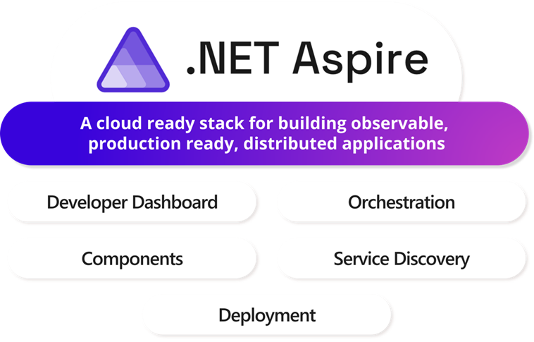

# Introduction to .NET Aspire



## What is .NET Aspire?

.NET Aspire is a comprehensive stack for building cloud-native applications. It provides:

- **Tools and Templates**: For creating observable, production-ready distributed applications
- **App Model**: A code-first approach defining your application's architecture
- **Unified Development**: Single source of truth for services, resources, and connections

## Core Features

### 1. Unified Toolchain
- One-command local debugging
- Consistent deployment across platforms:
  - Kubernetes clusters
  - Cloud providers
  - On-premises servers
- Same composition model everywhere

### 2. Key Capabilities

#### AppHost Orchestration
- Define services in code
- Manage dependencies
- Configure applications
- Control deployment flows

#### Rich Integrations
- Extensive NuGet package ecosystem
- Standardized service interfaces
- Pre-built components for common scenarios

#### Consistent Development Experience
- Visual Studio integration
- VS Code support
- Command-line interface (CLI)
- Cross-platform compatibility

## Extensibility

.NET Aspire is designed for customization:
- Adaptable APIs
- Flexible infrastructure integration
- Customizable service configurations
- Extensible workflow patterns

## Development Workflow

1. **Local Development**
   - Launch entire application stack
   - Debug multiple services
   - Monitor performance
   - Test integrations

2. **Deployment Options**
   - Container orchestration
   - Cloud services
   - On-premises hosting
   - Hybrid scenarios

3. **Observability**
   - Built-in monitoring
   - Distributed tracing
   - Performance metrics
   - Logging integration

## Documentation and Resources
- [Aspire Overview](https://learn.microsoft.com/en-us/dotnet/aspire/get-started/aspire-overview)
- [Architecture Overview](https://learn.microsoft.com/en-us/dotnet/aspire/architecture/overview)
- [Orchestration Overview](https://learn.microsoft.com/en-us/dotnet/aspire/fundamentals/app-host-overview)
- [Integrations Guide](https://learn.microsoft.com/en-us/dotnet/aspire/fundamentals/integrations-overview)
- [Dashboard Overview](https://learn.microsoft.com/en-us/dotnet/aspire/fundamentals/dashboard/overview)
- [Deployment Guide](https://learn.microsoft.com/en-us/dotnet/aspire/deployment/overview)

# Getting started

# 1. Local Dev Environment

Clone the eShop repository: https://github.com/petr-rudzenkou/eShop

## Prerequisites
1. [.NET 9](https://dotnet.microsoft.com/en-us/download)
2. [Azure CLI](https://learn.microsoft.com/en-us/cli/azure/install-azure-cli)
   - Windows
     ```powershell
     winget install --id Microsoft.AzureCLII
     ```
   - macOS
     ```bash
     brew update && brew install azure-cli
     ```
3. [Aspire CLI](https://learn.microsoft.com/en-us/dotnet/aspire/cli/install)
     ```powershell
     dotnet tool install -g Aspire.Cli --prerelease
     ```
4. OCI compliant container runtime:
   - Docker
      - [Install Docker Desktop on Windows](https://docs.docker.com/desktop/setup/install/windows-install/)
      - [Install Docker Desktop on Mac](https://docs.docker.com/desktop/setup/install/mac-install/)
   - Podman
      - [Podman Installation Instructions](https://podman.io/docs/installation)
      - [Podman for Windows guide](https://github.com/containers/podman/blob/main/docs/tutorials/podman-for-windows.md)
5. Integrated Developer Environment (IDE) or code editor:
   - [Visual Studio 2022](https://visualstudio.microsoft.com/vs/) version 17.9 or higher
   - [Visual Studio Code](https://code.visualstudio.com/)
     - Extension: [C# Dev Kit](https://marketplace.visualstudio.com/items?itemName=ms-dotnettools.csdevkit)

# 2. Exploring Runtime Architecture

## eShop Reference Application


## Running the Project

1. Start the application by running:
   ```
   dotnet run --project src/eShop.AppHost
   ```

2. Watch the console output for initialization messages

3. Look for the dashboard URL in the console output (typically something like `https://localhost:19888/login?t=4f08cd9d2bfc2a0ee873fdb8c7bf11e6`)

4. Open the Aspire dashboard in your browser to examine the application structure, logs, traces.

5. Check the running containers:
- Docker:
    ```
    docker ps
    ```
- Podman:
    ```
    podman ps
    ```


## Troubleshooting Common Issues

### Unhealthy resources
Give some time for the services to warm-up

### SSL Certificate Issues
If you encounter SSL/TLS connection errors, run:
    ```
    dotnet dev-certs https --trust
    ```

### Port Conflicts
If you experience port conflicts:
1. Stop all running Docker containers:
   ```
   docker stop $(docker ps -q)
   ```
2. Re-run the AppHost project

### Note
Make sure you've completed all the setup requirements from the Local Dev Environment guide before running the project.

## Documentation and Resources
- [Aspire Overview](https://learn.microsoft.com/en-us/dotnet/aspire/get-started/aspire-overview)
- [Architecture Overview](https://learn.microsoft.com/en-us/dotnet/aspire/architecture/overview)
- [Orchestration Overview](https://learn.microsoft.com/en-us/dotnet/aspire/fundamentals/app-host-overview)
- [Integrations Overview](https://learn.microsoft.com/en-us/dotnet/aspire/fundamentals/integrations-overview)
- [Networking Overview](https://learn.microsoft.com/en-us/dotnet/aspire/fundamentals/networking-overview)
- [Dashboard Overview](https://learn.microsoft.com/en-us/dotnet/aspire/fundamentals/dashboard/overview)

# 3. Publishing and Deployement

## 1. Aspire CLI (Preview)
The Aspire Command Line Interface will provide enhanced capabilities for:

### Features
- Project scaffolding and templates
- Local development orchestration
- Enhanced Publish/Deploy Semantics
- Support for generation of IaC artifacts for multiple providers (Bicep, Docker Compose, K8S, Terraform)
- Broader deployment targets, including non-Azure environments.

### How to install?

    ```
    dotnet tool install -g Aspire.Cli --prerelease
    ```

## 1. Aspire to Azure (Preview)

To get started with the Aspire Azure hosting integration, install the 📦 Aspire.Hosting.AppContainers NuGet package in the AppHost project.

    ```
    dotnet add package Aspire.Hosting.Azure.AppContainers --prerelease
    ```

After installing the package, add Azure Container App environment to your AppHost project using the AddAzureContainerAppEnvironment method:

    ```
    var aca = builder.AddAzureContainerAppEnvironment("aca-env");
    ```

To generate Bicep manifests from your Aspire application, use the aspire publish command:
    ```
    aspire publish -o aca-artifacts
    ```

To deploy Bicep manifests from your Aspire application, use the aspire deploy command:
    ```
    aspire deploy
    ```

## 1. Aspire to Kubernetes (Preview)

To get started with the Aspire Kubernetes hosting integration, install the 📦 Aspire.Hosting.Kubernetes NuGet package in the AppHost project.

    ```
    dotnet add package Aspire.Hosting.Kubernetes --prerelease
    ```

After installing the package, add a Kubernetes environment to your AppHost project using the AddKubernetesEnvironment method:

    ```
    var k8s = builder.AddKubernetesEnvironment("k8s");
    ```

To generate Kubernetes manifests from your Aspire application, use the aspire publish command:
    ```
    aspire publish -o k8s-artifacts
    ```

# Support Resources
- [Aspire publishing and deployment overview](https://learn.microsoft.com/en-us/dotnet/aspire/deployment/overview)
- [.NET Aspire Azure Container Apps Integration](https://learn.microsoft.com/en-us/dotnet/aspire/azure/configure-aca-environments)
- [.NET Aspire Kubernetes Integration](https://learn.microsoft.com/en-us/dotnet/aspire/deployment/kubernetes-integration)
- [.NET Aspire Docker Integration](https://learn.microsoft.com/en-us/dotnet/aspire/deployment/docker-integration)
- [Aspire CLI](https://learn.microsoft.com/en-us/dotnet/aspire/cli/install)