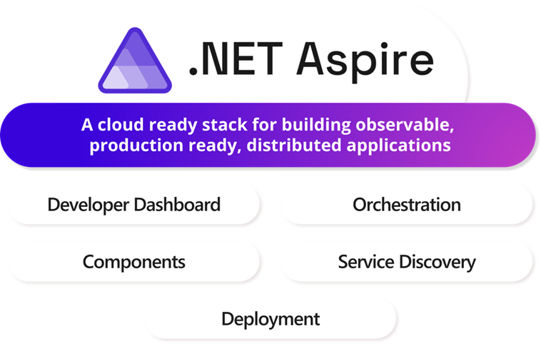

# Introduction to .NET Aspire

## What is .NET Aspire?

.NET Aspire is a comprehensive stack for building cloud-native applications. It provides:

- **Tools and Templates**: For creating observable, production-ready distributed applications
- **App Model**: A code-first approach defining your application's architecture
- **Unified Development**: Single source of truth for services, resources, and connections

## Core Features

### 1. Unified Toolchain
- One-command local debugging
- Consistent deployment across platforms:
  - Kubernetes clusters
  - Cloud providers
  - On-premises servers
- Same composition model everywhere

### 2. Key Capabilities

#### AppHost Orchestration
- Define services in code
- Manage dependencies
- Configure applications
- Control deployment flows

#### Rich Integrations
- Extensive NuGet package ecosystem
- Standardized service interfaces
- Pre-built components for common scenarios

#### Consistent Development Experience
- Visual Studio integration
- VS Code support
- Command-line interface (CLI)
- Cross-platform compatibility

## Extensibility

.NET Aspire is designed for customization:
- Adaptable APIs
- Flexible infrastructure integration
- Customizable service configurations
- Extensible workflow patterns

## Development Workflow

1. **Local Development**
   - Launch entire application stack
   - Debug multiple services
   - Monitor performance
   - Test integrations

2. **Deployment Options**
   - Container orchestration
   - Cloud services
   - On-premises hosting
   - Hybrid scenarios

3. **Observability**
   - Built-in monitoring
   - Distributed tracing
   - Performance metrics
   - Logging integration

## Documentation and Resources
- [Aspire Overview](https://learn.microsoft.com/en-us/dotnet/aspire/get-started/aspire-overview)
- [Architecture Overview](https://learn.microsoft.com/en-us/dotnet/aspire/architecture/overview)
- [Orchestration Overview](https://learn.microsoft.com/en-us/dotnet/aspire/fundamentals/app-host-overview)
- [Integrations Guide](https://learn.microsoft.com/en-us/dotnet/aspire/fundamentals/integrations-overview)
- [Dashboard Overview](https://learn.microsoft.com/en-us/dotnet/aspire/fundamentals/dashboard/overview)
- [Deployment Guide](https://learn.microsoft.com/en-us/dotnet/aspire/deployment/overview)