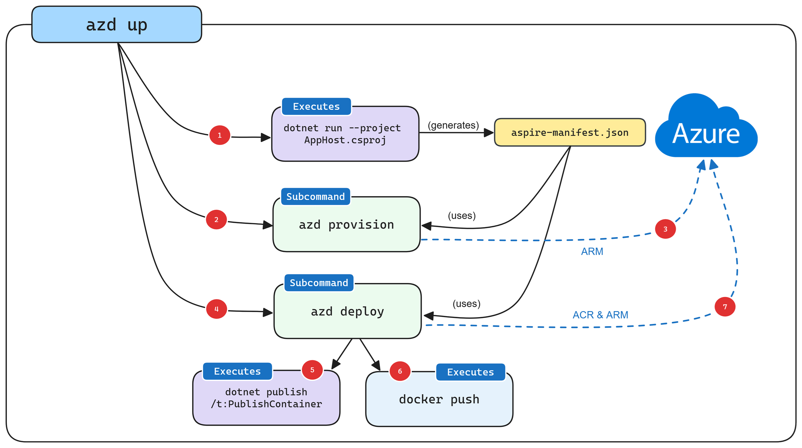

# Deploying to Azure

This guide walks you through deploying your Aspire application to Azure using the Azure Developer CLI (azd).

## Prerequisites

1. **Azure Account**: Active Azure subscription
2. **Azure CLI**: [Installation guide](https://learn.microsoft.com/en-us/cli/azure/install-azure-cli)
3. **Azure Developer CLI**: [Installation guide](https://learn.microsoft.com/en-us/azure/developer/azure-developer-cli/install-azd)

## 1. Azure Authentication

1. Authenticate with Azure AD:
   ```powershell
   azd auth login
   ```
   This will launch a browser window for authentication.

2. Verify your authentication:
   ```powershell
   az account show
   ```

## 2. Project Initialization

1. Initialize the project:
   ```powershell
   azd init
   ```

2. During initialization:
   - Select: `Use code in the current directory`
   - Confirm: `Confirm and continue initializing my app`
   - Enter environment name (e.g., `aspirelab`)

### Generated Configuration Files
The initialization creates:
- `azure.yaml` - Service and resource mappings
- `.azure/config.json` - Environment configuration
- `.azure/aspirelab/.env` - Environment variables

## 3. Deployment

Deploy using the complete workflow:
```powershell
azd up
```

## 4. Deployment Process

### A. Service Configuration
**Azure Settings**
 - Choose subscription
 - Select region

### B. Created Resources
- Resource Group
- Container Registry
- Log Analytics Workspace
- Container Apps Environment
- Application Container Apps

### C. Deployment flow



## 5. Post-Deployment Tasks

### A. Verification
1. **Resource Verification**
   - Check Azure Portal
   - Verify Container Apps status
   - Test endpoints

2. **Application Testing**
   - Access service endpoints
   - Test application functionality

## 6. Clean up resources
Remember to clean up the Azure resources that you've created during this walkthrough. Because azd knows the resource group in which it created the resources it can be used to spin down the environment using the following command:
```powershell
azd down
```

## 7. Troubleshooting Guide

### Common Issues
1. **Authentication Problems**
   ```powershell
   azd auth login --remove
   azd auth login
   ```

2. **Resource Provisioning Failures**
   - Check resource quotas
   - Verify region availability
   - Review service dependencies

3. **Deployment Errors**
   - Check Container Registry access
   - Verify network connectivity
   - Review application logs

4. **Dashboard - Could not authenticate user with requested resource**
   - Assign the **Container Apps Managed Environments Contributor** role to your user account at the Azure Container Apps environment scope

### Support Resources
- [Deploy an Aspire project to Azure Container Apps using the Azure Developer CLI (in-depth guide)](https://learn.microsoft.com/en-us/dotnet/aspire/deployment/azd/aca-deployment-azd-in-depth)